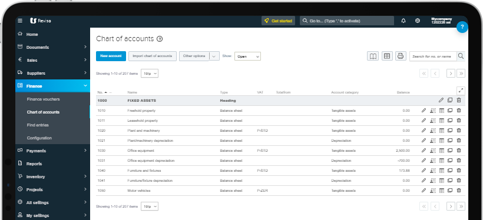

# Qcounts: A Mini Account Management System

A lightweight, Razor Pages-based accounting system built from scratch using only stored procedures — no LINQ, just clean, deliberate ADO.NET.

## Why I Built This

This project is part of a technical assignment during a job application. The goal was to build a real-world accounting system using ASP.NET Core Razor Pages and SQL Server — but with some tough constraints: no LINQ, and only stored procedures allowed.

While it looked scary at first, I took it as a chance to dive deep into how web apps talk to databases — without shortcuts.

## The Challenges I Faced

Coming from a competitive programming and C# background, I had little to no exposure to Razor Pages or stored procedures. I didn’t know how to structure pages, handle user roles, or even build forms that talk to SQL. 

Honestly, I felt lost at first — but I started breaking the problem down one piece at a time.

## My Approach

Instead of rushing, I focused on building one feature at a time:

1. **Authentication & Roles** — using ASP.NET Identity and custom roles (Admin, Accountant, Viewer).
2. **Chart of Accounts** — created a dynamic account system using a stored procedure and ADO.NET.
3. **Voucher Module** — built forms to save journal/payment/receipt vouchers in multi-line format.
4. **No LINQ** — all data access is raw ADO.NET with `SqlConnection`, `SqlCommand`, and stored procedures.

Each step was a learning moment, especially wiring dropdowns to SQL and looping through multi-line entries.

## Key Features
<<<<<<< .mine
- User Roles: Admin, Accountant, Viewer — with custom access.
- Chart of Accounts: Hierarchical parent-child account structure.
- Voucher Entry: Journal, Payment, and Receipt voucher support.
- Stored Procedure Only: No LINQ.

## Primary Technologies Used

- ASP.NET Core Razor Pages
- SQL Server + Stored Procedures
- ASP.NET Identity
- Git & GitHub for version control

## Screenshots & UI Overview

### Landing Page

### Register Page

### Login Page

### Chart of Accounts

### Voucher Entry
