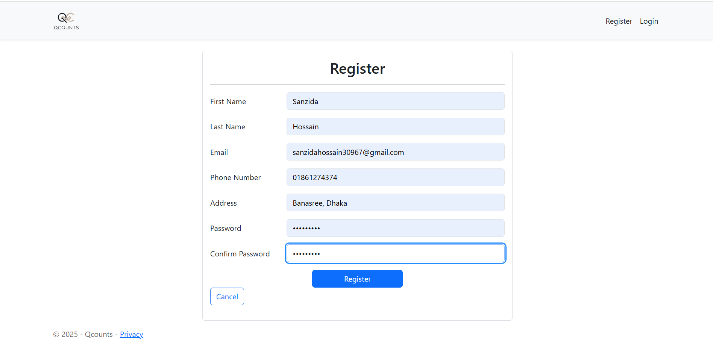
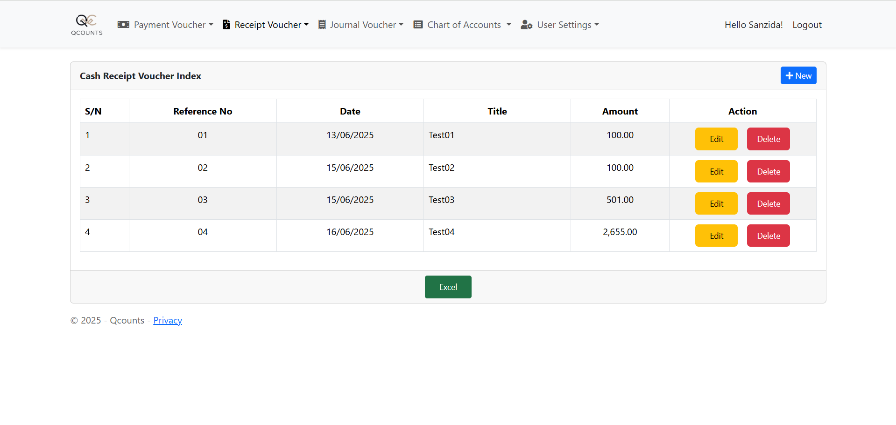
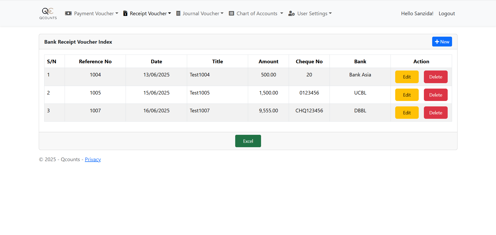
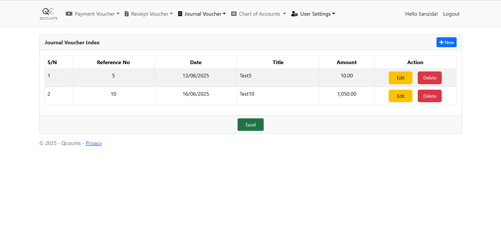
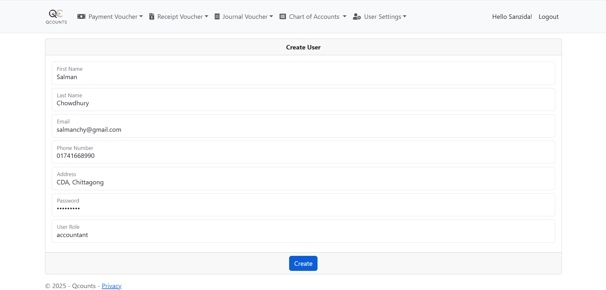

# Qcounts: A Mini Account Management System

A lightweight, Razor Pages-based accounting system built from scratch using only stored procedures — no LINQ, just clean, deliberate ADO.NET.

## Why I Built This

This project is part of a technical assignment during a job application. The goal was to build a real-world accounting system using ASP.NET Core Razor Pages and SQL Server — but with some tough constraints: no LINQ, and only stored procedures allowed.

While it looked scary at first, I took it as a chance to dive deep into how web apps talk to databases — without shortcuts.

## The Challenges I Faced

Coming from a competitive programming and C# background, I had little to no exposure to Razor Pages or stored procedures. Previously, I had worked with Entity Framework, ADO.NET + LINQ and had some basic knowledge of the .NET Core MVC framework. Working with Razor Pages and Stored Procedures — both being new to me — was initially challenging, but it pushed me to understand deeper aspects of request handling, server-side rendering, and direct database interaction using parameterized queries. Over time, I became comfortable with defining and executing stored procedures, binding data to Razor Pages, and organizing logic in a cleaner, more maintainable way. This experience has significantly expanded my understanding of full-stack development within the .NET ecosystem.

## My Approach

Instead of rushing, I focused on building one feature at a time:

1. **Authentication & Roles** — using ASP.NET Identity and custom roles (Admin, Accountant, Viewer).
2. **Chart of Accounts** — created a dynamic account system using stored procedures (spCreateControl, spCreateSubSidiary) and ADO.NET.
3. **Voucher Module** — built forms to save journal/payment/receipt vouchers in multi-line format.
4. **No LINQ** — all data access is raw ADO.NET with `SqlConnection`, `SqlCommand`, and stored procedures.

Each step was a learning moment, especially wiring dropdowns to SQL and looping through multi-line entries.

## Key Features

- User Roles: Admin, Accountant, Viewer — with custom access.
- Chart of Accounts: Hierarchical parent-child account structure.
- Voucher Entry: Journal, Payment, and Receipt voucher support.
- Stored Procedure Only: With ADO.Net and No LINQ.

## Primary Technologies Used

- ASP.NET Core Razor Pages
- SQL Server + Stored Procedures
- ASP.NET Identity
- Git & GitHub for version control

## Screenshots & UI Overview

### Login Page

### Register Page

### Landing Page
#### ADMIN

#### Accountant

#### Viewer

### Payment Voucher
#### Add Cash Payment

#### View Cash Payment

#### Add Bank Payment

#### View Bank Payment

### Receipt Voucher
#### Add Cash Receipt

#### View Cash Receipt

#### Add Bank Receipt

#### View Bank Receipt

### Journal Voucher
#### Add Journal Voucher

#### View Journal Voucher

### Chart of Accounts
#### Add Control 

#### View Controls

#### Add Sub-Sidiary

#### View Sub-Sidiary

### User Settings
#### Create User

#### View Users

### Export Report 

#### File Name (Voucher Type Name + Date_Time).xlsx

